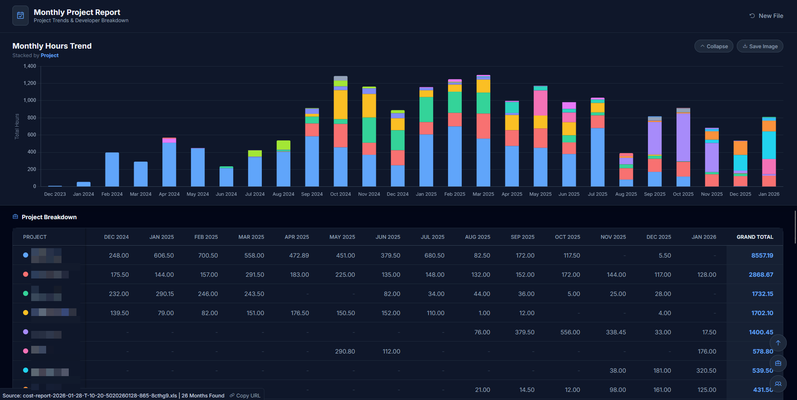

# Open Project Report Visualizer

## Overview

The **Cost Report Visualizer** is a specialized, client-side web application designed to transform raw Excel and CSV cost reports into high-fidelity visual analytics. By processing data locally within the browser, it ensures low-latency performance and absolute data privacy, making it an ideal tool for sensitive project management reporting.

## Screenshot



## Key Features

* **Project-Based Monthly Trends:** Generates a stacked bar chart visualizing total hours logged per month, segmented by project.
  * *Intelligent Filtering:* Automatically excludes inactive projects (zero hours) to maintain chart clarity.
  * *Granular Tooltips:* Provides detailed hour breakdowns per project upon interaction.

* **Developer Utilization Matrix:** A comprehensive data table displaying exact hour logs per developer, organized chronologically.

* **Enhanced Table Navigation:**
  * *Floating Sticky Headers:* Active table headers stay visible while their table section is in view.
  * *Horizontal Scroll + Fixed First Column:* Project/Developer names stay visible during horizontal scrolling.
  * *Synced Scrolling:* Floating headers mirror horizontal scroll for accurate column alignment.

* **Intelligent File Handling:**
  * *URL Parameter Support:* Create bookmarkable URLs for quick access to specific reports.
  * *Automatic Caching:* Files cached in IndexedDB for instant reload within 1 hour.
  * *One-Click Reload:* Restore the last loaded file if it is still cached.

* **Dark Mode Interface:** A professional, high-contrast dark theme optimized for readability and extended usage.

* **Smart Header Detection:** Algorithms automatically identify the correct data schema, bypassing metadata rows often found in exported reports.

* **High-Resolution Export:** One-click functionality to render and download charts as PNG files for presentation decks.

* **Dashboard Controls:** Collapse/expand the chart and use floating navigation buttons to jump between sections.

## Input Specifications

The application is engineered to parse standard Cost Reports exported in `.xls`, `.xlsx`, or `.csv` formats. The parser automatically detects the following required columns regardless of column order:

| Column Name | Description |
| :--- | :--- |
| **Date (Spent)** or **Date** | Primary temporal key used for grouping data into monthly intervals (X-Axis). |
| **User** | Identifier for the developer resource, used for the utilization matrix. |
| **Project** | Grouping key for the stacked chart segments. |
| **Units** | Numerical value representing the billable hours. |

## Usage Guide

### Standard Workflow

1. **Deployment:** Clone the repo and serve it with a local web server (localhost or vhost).
2. **Launch:** Open the site in a browser (Google Chrome, Microsoft Edge, Firefox, or Safari).
3. **Data Ingestion:** Drag and drop the target Cost Report file into the designated upload area.
4. **Analysis:** The dashboard will render immediately upon successful file parsing.
5. **Export:** Select "Save Image" to export the visual data for external reporting.

**Quick server options (choose one):**
- `python -m http.server 8000` then open `http://localhost:8000/`
- `npx serve` then open the printed localhost URL

### Advanced Features

#### Quick Reload with URL Parameters

Create bookmarkable URLs for frequently analyzed reports:

```
http://localhost:8000/index.html?upload="filename.xls"
```

**Example:**
```
http://localhost:8000/index.html?upload="cost-report-2026-01-28.xls"
```

**How it works:**
1. Load a file normally (drag & drop or click to upload)
2. Click "Copy URL" button in the footer
3. Paste and save the URL as a browser bookmark
4. Next time you open the bookmark:
   - If the file was cached (within 1 hour), it loads automatically
   - Otherwise, the application highlights the expected filename for easy selection

#### Automatic File Caching

- Files are automatically cached in browser storage (IndexedDB)
- Cached files remain valid for 1 hour
- Enables instant reload without re-uploading
- Click "Reload: [filename]" button when available to restore the last loaded file

## Technical Architecture

This tool is a static web app (HTML + CSS + JS assets) to ensure maximum portability and ease of distribution. It leverages the following libraries via CDN:

* **SheetJS (xlsx):** Enterprise-grade parsing for spreadsheet data structures.
* **Chart.js:** A flexible charting library for rendering responsive, interactive visualizations.
* **Tailwind CSS:** A utility-first CSS framework for rapid, responsive UI development.
* **Phosphor Icons:** A clean, consistent icon family for the user interface.

## Project Structure

The repository is organized for easy onboarding and straightforward edits:

```
index.html
assets/
  css/
    app.css
  img/
    snapshot.png
  js/
    boot.js
    charts.js
    data-processing.js
    dom.js
    scroll.js
    state.js
    storage.js
    tables.js
    ui.js
    utils.js
README.md
```

**Assets at a glance:**
- `assets/css/app.css`: Core styling and custom UI behaviors (dark mode, sticky columns, floating headers).
- `assets/js/boot.js`: App bootstrap and event wiring on page load.
- `assets/js/charts.js`: Chart rendering, styling, and PNG export logic.
- `assets/js/data-processing.js`: File parsing, schema detection, and data normalization.
- `assets/js/dom.js`: Centralized DOM references and cache.
- `assets/js/scroll.js`: Scroll navigation and smart sticky header orchestration.
- `assets/js/state.js`: Shared app state and globals.
- `assets/js/storage.js`: URL parameter handling, caching, and reload workflows.
- `assets/js/tables.js`: Project and developer table rendering.
- `assets/js/ui.js`: View switching and chart toggle interactions.
- `assets/js/utils.js`: Shared helpers (formatting, colors, escaping).
- `assets/img/snapshot.png`: README screenshot for quick product context.

## System Notes

* **Data Filtration:** Entries with zero hours are programmatically filtered out to ensure visualization integrity.
* **Unit Formatting:** All numerical values are treated as hours (h) by default.
* **Date Compatibility:** The system supports both Excel serial date formats and standard ISO string formats (e.g., YYYY-MM-DD).

---

© darkcolonist@gmail.com
