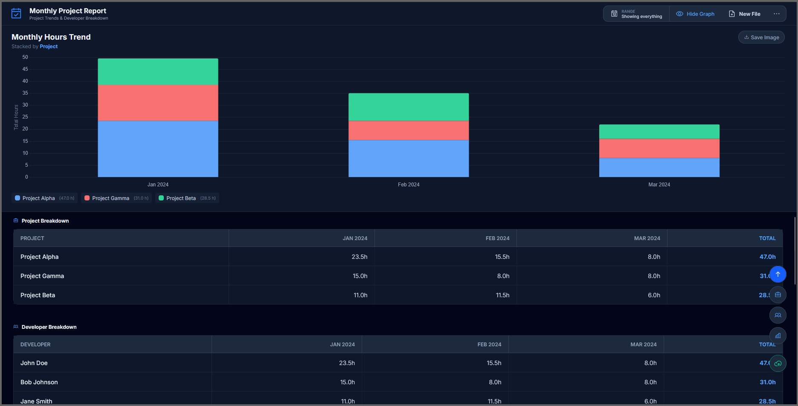
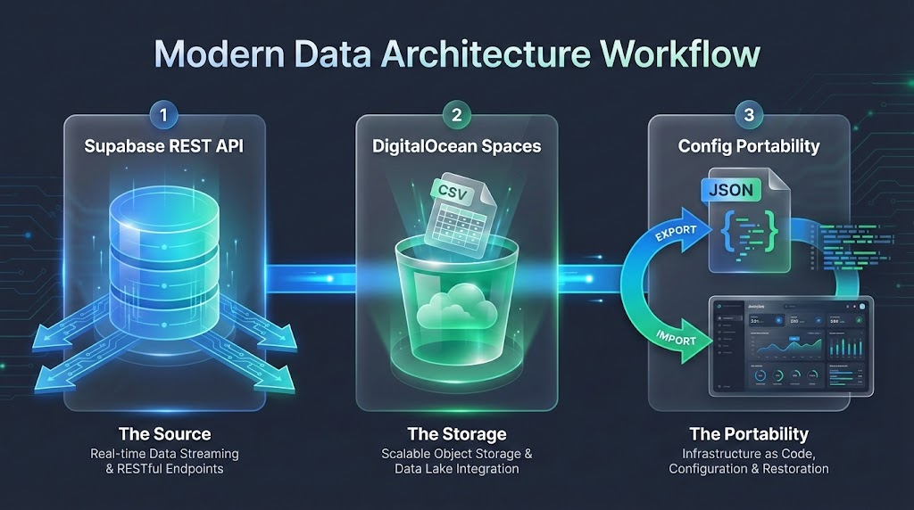

# Open Project Report Visualizer

## Overview

The **Open Project Report Visualizer** is a specialized, client-side web application designed to transform raw Excel and CSV cost reports into high-fidelity visual analytics. Built with **Vue 3** and **Vite**, it processes data locally within the browser, ensuring low-latency performance and absolute data privacy, making it an ideal tool for sensitive project management reporting.

## Screenshot



## How it works




## Key Features

* **Project-Based Monthly Trends:** Generates a stacked bar chart visualizing total hours logged per month, segmented by project.
  * *Intelligent Filtering:* Automatically excludes inactive projects (zero hours) to maintain chart clarity.
  * *Granular Tooltips:* Provides detailed hour breakdowns per project upon interaction.

* **Developer Utilization Matrix:** A comprehensive data table displaying exact hour logs per developer, organized chronologically.

* **Developer Project Insights:** An interactive dashboard section for deep-dive analysis of individual contributions.
  * *Resource Selection:* Filter data by specific developer to see their multi-month workload trends.
  * *Project-Specific Drilling:* Narrow down any developer's view to a single project or view their stacked contribution across all projects.
  * *Instant Hour Totals:* Dropdown selectors display real-time total hour counts for both developers and projects.
  * *Smart Tooltip Filtering:* Monthly breakdown tooltips automatically hide zero-hour projects for the selected developer.

* **Enhanced Table Navigation:**
  * *Floating Sticky Headers:* Active table headers stay visible while their table section is in view.
  * *Horizontal Scroll + Fixed First Column:* Project/Developer names stay visible during horizontal scrolling.
  * *Synced Scrolling:* Floating headers mirror horizontal scroll for accurate column alignment.

* **Intelligent File Handling:**
  * *URL Parameter Support:* Create bookmarkable URLs for quick access to specific reports.
  * *Automatic Caching:* Up to 5 most recent files cached in IndexedDB for 24 hours.
  * *Recently Uploaded Files:* Visual list showing cached files with row counts and upload timestamps.
  * *One-Click Reload:* Load any cached file instantly from the upload page.
  * *Cache Management:* Clear all cached files with a single click and confirmation.
  * *File Validation:* Automatic detection of invalid file formats with clear error messages and a downloadable sample template.
  * *Smart Cache Prevention:* Invalid files are rejected before caching to maintain data integrity.

* **Modern Dark Mode Interface:** A professional, high-contrast dark theme built with Tailwind CSS 4, optimized for readability and extended usage.

* **Smart Header Detection:** Algorithms automatically identify the correct data schema, bypassing metadata rows often found in exported reports.

* **High-Resolution Export:** One-click functionality to render and download charts as PNG files for presentation decks.

* **Dashboard Controls:** Collapse/expand the chart and use floating navigation buttons to jump between sections (Trends, Projects, Developers, Insights).

* **Supabase Integration:**
  * *Direct API Connection:* Connect via your Supabase URL and Anon/Public Key.
  * *Configurable Range:* Select specific date ranges to fetch from the database.
  * *Intelligent Sorting:* Data is fetched newest-first from the database.
  * *Persistence:* Credentials and fetched data are cached securely in your browser.

* **DigitalOcean Spaces Integration:**
  * *Cloud Hosting:* Upload processed reports directly to DigitalOcean Spaces as CSV files.
  * *Collaboration:* Generate unique, shareable URLs for others to view the same report instantly.
  * *High-Fidelity Sharing:* Preserves exact daily data across shared sessions, ensuring consistent reporting views.
  * *Subpath Support:* Organize uploads into specific folders or subdomains within your bucket (e.g., `project/client-a/`).
  * *URL-Based Loading:* The application can parse and render reports directly from a public Spaces URL via the custom `#/dashboard/spaces/` hash route.

## Cloud Configuration (DigitalOcean Spaces)

To enable cloud uploads and sharing, configure your Spaces credentials in the **Settings** menu:
1. **Endpoint**: Your region-specific endpoint (e.g., `https://nyc3.digitaloceanspaces.com`).
2. **Access/Secret Key**: Your DigitalOcean API credentials.
3. **Bucket Name**: The target Spaces bucket for storage.
4. **Subpath (Optional)**: A folder prefix for your uploads.

> [!IMPORTANT]
> **CORS Configuration:** You must configure your DigitalOcean Spaces bucket to allow cross-origin requests from your application domain. Add a CORS rule allowing `PUT`, `GET`, `OPTIONS`, and `POST` methods with `*` for Origins and Headers for full functionality.

## Input Specifications

The application is engineered to parse standard Cost Reports exported in `.xls`, `.xlsx`, or `.csv` formats. The parser automatically detects the following required columns regardless of column order:

| Column Name | Description |
| :--- | :--- |
| **Date (Spent)** or **Date** | Primary temporal key used for grouping data into monthly intervals (X-Axis). |
| **User** | Identifier for the developer resource, used for the utilization matrix. |
| **Project** | Grouping key for the stacked chart segments. |
| **Units** | Numerical value representing the billable hours. |

**File Validation:** The application validates uploaded files to ensure they contain the required columns and valid data. If a file doesn't match the expected format, an error message will be displayed with instructions. A sample template file is available for download on the upload page.

## Usage Guide

### Getting Started

1. **Install Dependencies:**
   ```bash
   npm install
   ```

2. **Run Development Server:**
   ```bash
   npm run dev
   ```

3. **Build for Production:**
   ```bash
   npm run build
   ```

### Standard Workflow

1. **Launch:** Open the local dev URL in a modern browser.
2. **Data Ingestion:** Drag and drop the target Cost Report file into the designated upload area or connect via Supabase.
3. **Analysis:** The dashboard will render immediately upon successful file parsing or data fetch.
4. **Export:** Select "Save Image" to export the visual data for external reporting.

## Technical Architecture

This application is built using modern web technologies for performance and maintainability:

* **Vue 3:** Reactive UI framework for a dynamic and responsive user experience.
* **Vite:** High-performance build tool and development server.
* **Tailwind CSS 4:** Utility-first CSS framework for rapid UI development and theming.
* **Chart.js:** Robust library for rendering responsive and interactive visualizations.
* **ExcelJS & XLSX:** Robust parsing for various spreadsheet data structures.
* **Air Datepicker:** Lightweight and customizable date range picker.
* **Phosphor Icons:** Consistent and clean iconography.
* **AWS SDK for JS (S3):** Powering the seamless DigitalOcean Spaces uploads.

## Project Structure

```
src/
  assets/         # Static assets and global styles
  components/     # Reusable Vue components
    common/       # Shared UI elements
    dashboard/    # Dashboard-specific components
    UploadView.vue # Main upload/connection view
  router/         # Vue Router configuration
  store/          # State management (using reactive globals/signals)
  utils/          # Helper functions and data processing logic
  views/          # Page-level components
  App.vue         # Root application component
  main.js         # Application entry point
public/           # Public static assets
supabase/         # Database schemas and integration scripts
index.html        # Entry HTML file
package.json      # Project dependencies and scripts
vite.config.js    # Vite configuration
```

## System Notes

* **Data Filtration:** Entries with zero hours are programmatically filtered out to ensure visualization integrity.
* **Unit Formatting:** All numerical values are treated as hours (h) by default.
* **Date Compatibility:** The system supports both Excel serial date formats and standard ISO string formats (e.g., YYYY-MM-DD).

---

© darkcolonist@gmail.com
